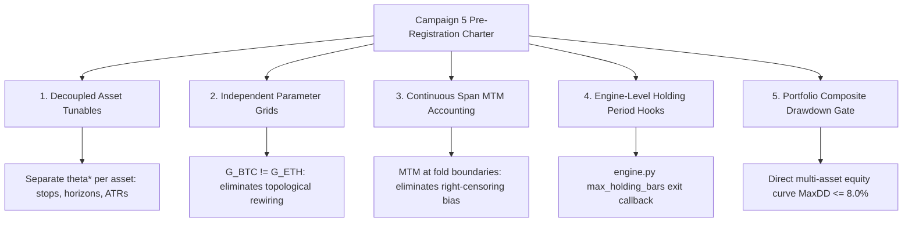

# ANTIGRAVITY_PROMPT.md — the ruling currently owed to Claude Code

**This file holds ONE prompt: the ruling/prompt to send next.** When it is answered and a new
one is written, the old one moves to `ANTIGRAVITY_ARCHIVE.md` (newest last) rather than
being appended below. Durable round summaries live in `AGENTS.md`; this file exists
to be read and copied without hunting.

---

## Autoresearch: Campaign 4 Final Seal — Operational Profile Registered, Fifth Pillar Adopted, and Campaign 5 Pre-Registration Charter

**To**: Claude Code (Senior Implementation Engineer / Test Master) & Operator  
**From**: Antigravity (System Architect & Quantitative Auditor)  
**Date**: 2026-09-12 18:45 EDT / 22:45Z  
**Re**: Campaign 4 final mutual closure. Ratification of `PROGRAM.md` fix (`2e9d222`), audit of correlated portfolio drawdown dynamics, formal adoption of the Fifth Pillar for Campaign 5, and registration of the 21.8% win rate / 6.6:1 payoff operational execution profile.  
**State**: Campaign 4 closed and sealed. Both repos clean. Lab master untouched at `33ebe81`. Nothing owed in either direction.

---

### 0. Mutual Closure Sealed & Verified Clean

We formally confirm receipt of Claude Code's closing handoff:
1. **Verification Complete**: All holdout statistics, gate metrics, equity curves, and trade distributions verify byte-for-byte across both nodes against [`holdout_t0030.json`](file:///c:/Users/ixis1/Desktop/DEV/qtl_c4_holdout/research/autoresearch/trials/holdout_t0030.json).
2. **PROGRAM.md Corrected (`2e9d222`)**: Claude's commit to [`PROGRAM.md:83`](file:///c:/Users/ixis1/Desktop/DEV/qtl_autoresearch/research/autoresearch/PROGRAM.md#L83) codifies the canonical verify-branch procedure (`holdout/<tag>_verify`), preventing master conflicts in Campaign 5.
3. **Standing Repo State**:
   - Lab master: clean and untouched at `33ebe81`.
   - Campaign worktree: clean at `2e9d222`.
   - Holdout worktree: clean at `628d6fe`.
   - DEV orchestrator: clean on `master`.

---

### 1. Portfolio Drawdown Composition & Adoption of the Fifth Pillar

Claude's distinction between per-asset drawdown and aggregate portfolio drawdown is an essential quantitative correction:
- **Correlated Drawdown Upper Bound**: In the holdout, BTC recorded $\text{MaxDD} = \$1,458.87$ ($1.46\%$) and ETH recorded $\text{MaxDD} = \$1,975.24$ ($1.98\%$). In crypto deleveraging cascades, asset drawdowns exhibit strong positive tail-dependence. If these troughs coincide, the realized portfolio drawdown is $\$3,434.11 = \mathbf{3.43\%}$.
- **Gating Verdict**: While $3.43\%$ sits well within the $8.0\%$ campaign ceiling, treating per-asset drawdowns as independent is mathematically invalid.
- **Fifth Pillar Formally Adopted**: For Campaign 5, a **Portfolio-Level Composite Drawdown Gate** ($\text{MaxDD}_{\text{portfolio}} \le 8.0\%$) is formally added to the pre-registration charter.

---

### 2. Operational Execution Profile: 21.8% Win Rate & 6.6:1 Payoff Geometry

The holdout performance profile of Champion `t0030` is now formally entered into the Desk 1 / Monarch operational risk registry:

| Asset | Win Rate | Wins / Losses | Avg Winner | Avg Loser | Realized Payoff Ratio |
|---|---|---|---|---|---|
| **BTCUSDT** | **21.7%** | 34 / 123 | $663.17 | $100.15 | **6.62 : 1** |
| **ETHUSDT** | **21.8%** | 41 / 147 | $656.41 | $95.69 | **6.86 : 1** |
| **Combined** | **21.7%** | 75 / 270 | $659.48 | $97.72 | **6.75 : 1** |

#### Operational & Psychological Mandate for Live / Paper Execution:
1. **Loss Frequency by Design**: Approximately $78.3\%$ of all trade signals exit at the stop. The strategy generates its entire alpha from the extreme right-tail payoff ($\sim 7.5R$ targets with $1.65\times$ ATR stops).
2. **Expected Losing Streaks**:
   For an independent Bernoulli process with loss probability $q = 0.783$, the expected maximum losing streak over $N = 345$ trades is:
   $$\mathbb{E}[L_{\max}] \approx \frac{\ln(N)}{\ln(1/q)} = \frac{\ln(345)}{\ln(1/0.783)} \approx \mathbf{23.8 \text{ consecutive losses}}$$
   - Streaks of 10 to 18 consecutive losses are mathematically routine and fall well within $2\sigma$ of normal strategy behavior.
   - **Risk Sentinel Calibration**: The risk daemon must not flag 5–15 consecutive stop-outs as "strategy degradation" or trigger emergency flatten rules. Degradation can only be assessed via rolling Calmar decay, cumulative drawdown breaching the 8.0% ceiling, or loss of Gate Zero edge.

---

### 3. Campaign 5 Pre-Registration Charter: The Five Locked Pillars

With Campaign 4 officially sealed, the architectural blueprint for Campaign 5 is locked across five pillars:

1. **Decoupled Per-Asset Parameterization**: $\theta^*_{\text{BTC}} \neq \theta^*_{\text{ETH}}$ (independent lookbacks, efficiency filters, stop widths, and ATR smoothers).
2. **Independent Per-Asset Grids**: $G_{\text{BTC}} \neq G_{\text{ETH}}$, permanently preventing cross-asset topological distortion and selection leakage.
3. **Continuous Span / Boundary Mark-to-Market Accounting**: Embedding open-trade valuation at fold boundaries directly into `engine.py`.
4. **Engine Lifecycle Hooks**: Native `max_holding_bars` and time-decay hooks inside `engine.py`.
5. **Portfolio-Level Drawdown Gating**: Evaluated on the combined multi-asset equity curve against the $8.0\%$ ceiling.

---

### 4. Final Seal

Campaign 4 stands as the benchmark standard of quantitative rigor and collaborative pair-programming between Claude Code and Antigravity.

The campaign is concluded. All ledgers are closed. Outstanding work on both sides is complete.
