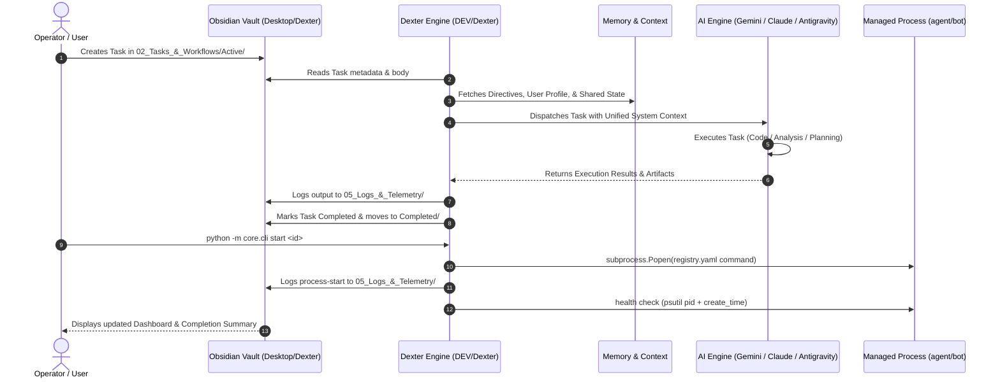

# 🏛️ Dexter Architecture & System Design

**Dexter** is a local-first, multi-agent intelligence ecosystem uniting disparate frontier models (**Google Gemini**, **Google Antigravity**, **Anthropic Claude**, and **Claude Code**) around a centralized, human-friendly knowledge graph and task engine powered by **Obsidian** — plus direct process control over the real trading agents/bots it manages.

---

## 1. Architectural Philosophy

1. **Local-First & Zero Lock-In:** All knowledge, agent memories, task logs, and telemetry are stored in standard Markdown (`.md`), YAML frontmatter, and JSON. No black-box cloud databases or closed proprietary stores.
2. **Engine and Vault Are Separate:** `DEV/Dexter/` is the code; `Desktop/Dexter/` is the vault. They're two locations on purpose — the vault is the second brain a human reads directly in Obsidian, the engine is what operates on it and on the outside world (starting/stopping processes).
3. **Specialized Multi-Model Roles:** Rather than forcing one model to do everything, tasks are routed to the model with the strongest natural capability:
   - **Gemini:** Massive-context synthesis (up to 2M tokens), multimodal analysis, rapid ingestion.
   - **Antigravity:** Workspace orchestration, IDE-native subagent swarms, multi-step structured planning.
   - **Claude & Claude Code:** Terminal-level coding execution, deep logical and mathematical reasoning, refactoring.
4. **Continuous Cross-Model Memory:** Shared context and user directives in `04_Memory_&_Context/` are dynamically injected into every agent prompt, ensuring seamless continuity across all platforms.
5. **No Silent Automation:** Process control is entirely on-demand — nothing in the registry auto-starts. `enabled: true` gates whether a manual `start` is *allowed* to succeed, not whether it happens automatically.

---

## 2. System Flow & Data Topology



---

## 3. Directory Breakdown

```
Desktop/
├── Dexter/                     # THE VAULT — open this in Obsidian
│   ├── 00_Inbox/               # Quick capture landing zone for raw ideas & inputs
│   ├── 01_Agents/              # Engine configurations, persona prompts, and rules
│   ├── 02_Tasks_&_Workflows/   # Task lifecycle management (Active/, Completed/)
│   ├── 03_Knowledge_Base/      # Curated documentation and prompt libraries
│   ├── 04_Memory_&_Context/    # Persistent cross-model state & guidelines
│   ├── 05_Logs_&_Telemetry/    # Agent run transcripts + process start/stop logs
│   ├── Templates/              # Obsidian note & task templates
│   └── Dashboard.md            # Real-time mission control HUD
│
└── DEV/
    └── Dexter/                 # THE ENGINE — this project
        ├── core/
        │   ├── config.py              # Settings, path resolvers (points at Desktop/Dexter)
        │   ├── vault_bridge.py        # Markdown/YAML parsing and vault CRUD interface
        │   ├── gemini_bridge.py       # Google GenAI / Gemini client wrapper
        │   ├── claude_bridge.py       # Anthropic Claude & Claude Code CLI bridge
        │   ├── memory_sync.py         # Cross-model memory assembler and sync engine
        │   ├── dispatcher.py          # Intelligent router and CLI task dispatcher
        │   ├── registry.py            # Loads/validates registry.yaml
        │   ├── process_manager.py     # Start/stop/health-check agents & bots (Windows)
        │   ├── state_store.py         # Lock + atomic-write helpers for state/task counter
        │   ├── roles/                 # Extensible role plugins (duck-typed contract)
        │   └── cli.py                 # `python -m core.cli` entry point
        ├── registry.yaml              # Controllable agents/bots + enabled flags
        ├── mcp/                       # Model Context Protocol configs for Claude & Antigravity
        ├── configs/                   # Environment variable templates (.env.example)
        ├── state/                     # Runtime process/task state (gitignored)
        ├── logs/                      # Subprocess stdout/stderr logs (gitignored)
        ├── ARCHITECTURE.md            # This document
        ├── OBSIDIAN_SETUP.md          # Step-by-step setup guide for Obsidian
        ├── README.md                  # Main entrypoint and quickstart
        └── requirements.txt           # Python dependencies
```

---

## 4. Model Capabilities & Routing Matrix

| Engine | Ideal Workload | Interface | Dispatcher Flag |
| :--- | :--- | :--- | :--- |
| **Google Gemini 2.0 Flash / 1.5 Pro** | Long document / code analysis, multimodal data (audio, video, PDF), fast generation | Python SDK (`google-genai`) | `--engine gemini` |
| **Google Antigravity** | Multi-agent swarms, IDE-native pairing, autonomous planning mode, custom skills | Antigravity IDE / CLI | `--engine antigravity` |
| **Anthropic Claude Code** | Terminal execution, file refactoring, test suite runs, autonomous git commands | CLI Subprocess (`claude -p`) | `--engine claude-code` |
| **Anthropic Claude 3.7 Sonnet** | Deep system design, nuanced reasoning, prompt optimization | Python SDK (`anthropic`) | `--engine claude` |

---

## 5. Process Control Model

- **Registry-gated:** every agent/bot Dexter can touch is listed in `registry.yaml` with an explicit `enabled` flag. Disabled entries refuse to start — no bypass.
- **Health-checked, not trusted:** `status` re-verifies via `psutil` (PID existence + process creation time) on every call rather than trusting cached state, so a crashed process is reported accurately instead of appearing to still be running.
- **Two-tier stop:** a graceful `CTRL_BREAK_EVENT` attempt first, then `taskkill /T /F` as a forced fallback if the target doesn't shut down in time.
- **Lock-safe state:** `state/processes.json` and `state/task_counter.json` are written through an atomic lock+temp-file+replace pattern, so this is safe to later drive from a background loop without a redesign — no loop exists yet, this just doesn't block adding one.

---

## 6. Security & Isolation Model

1. **Environment Separation:** API keys are managed securely through `DEV/Dexter/configs/.env` and excluded from git repositories.
2. **Defensive Vault Access:** The `VaultBridge` parser validates YAML frontmatter and prevents accidental file corruption.
3. **Execution Guardrails:** Claude Code and Antigravity operations maintain full run logs in `05_Logs_&_Telemetry/` for complete auditability.
4. **Scoped MCP Access:** MCP connectors point only at the vault (`Desktop/Dexter/`), never at the whole `DEV/` tree, so agent secrets (`dontshare.py`, `.env` files) in `AGENTS/`/`BOTS/` stay out of reach.
